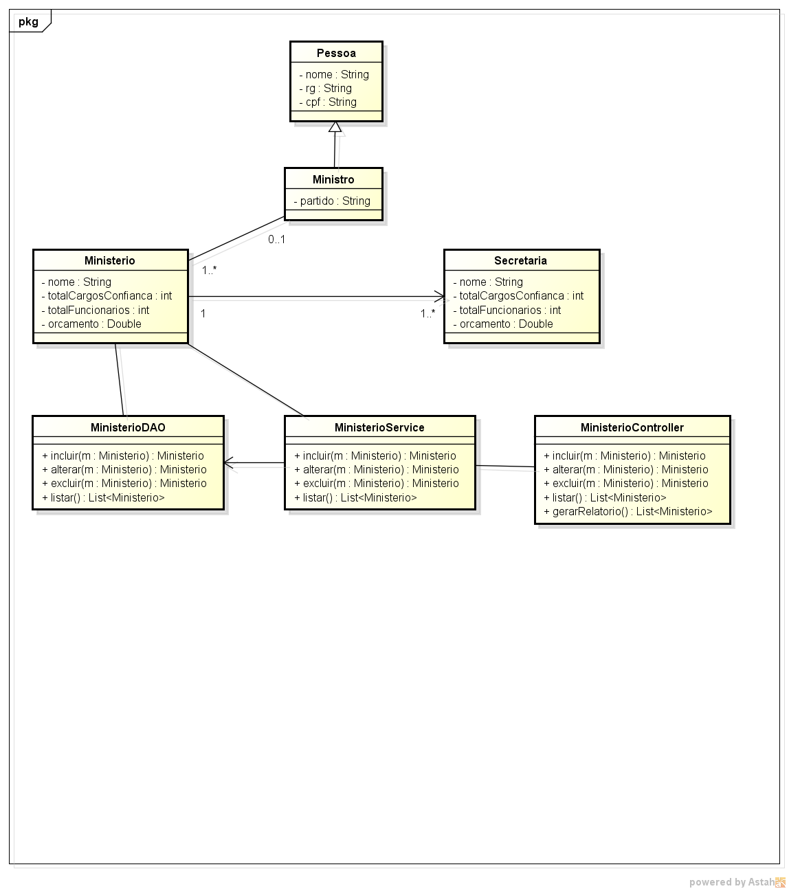

# Descrição do Problema
Um presidente precisa organizar seus ministérios de acordo com as indicações políticas e as suas convicções. Para isto é preciso cadastrar na web e gerar um relatório dos ministérios com suas secretarias. Todos os ministérios e secretarias terão
seu ministro, cargos de confiança, um total de número de funcionários e seu orçamento da nação.

 Modelar em UML as classes para o Projeto:
- Criar banco de dados para classes do modelo;
- Gerar interface REST para os dados
- Apresentar os dados em Interface WEB.

# UML (astah)

# Banco de Dados (H2)
Abrir Arquivo:  [Banco de Dados](src/main/resources/CreateDatabase.sql)

# CURL
Abrir Arquivo: [curl.txt](src/main/resources/curl.txt) 